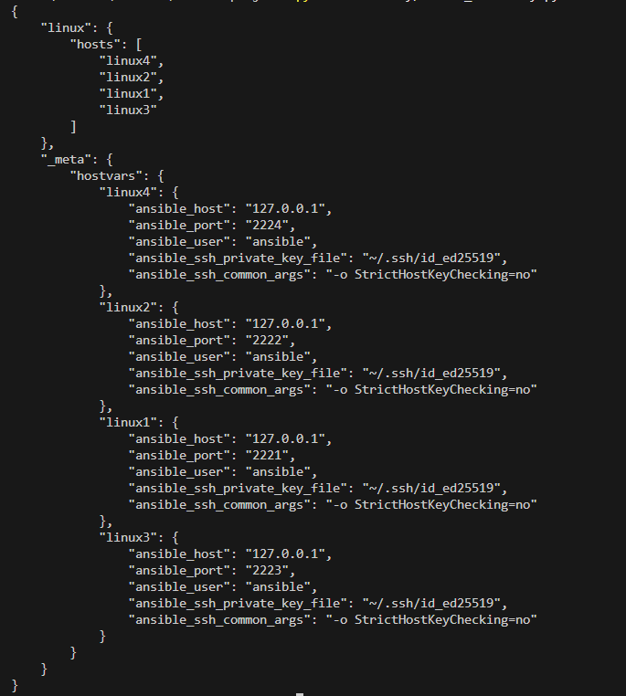
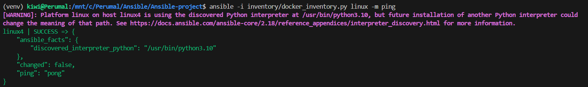
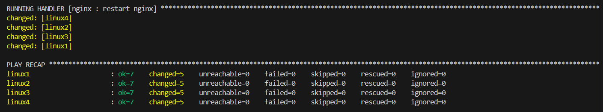

# 🚀 Advanced Ansible Configuration Management Lab (Docker-Based)

This project demonstrates **advanced Ansible configuration management** using:

* 🐳 Docker containers as virtual machines
* ⚙️ Dynamic inventory (Python + Docker SDK)
* 🔐 SSH key-based authentication
* 🧩 Modular Ansible roles
* 📦 Real-world service deployment (Nginx)

---

# 🧱 Architecture Overview

* **Control Node**: WSL (Ansible installed)
* **Managed Nodes**: Docker containers (Linux)
* **Inventory**: Dynamic (Python script)
* **Configuration**: Role-based (Ansible roles)

---

# 📁 Project Structure

```
ansible-docker-lab/
│
├── docker/
│   ├── docker-compose.yml
│   ├── linux/
│   │   └── Dockerfile
│   └── windows/
│       └── Dockerfile
│
├── inventory/
│   ├── hosts.ini
│   └── docker_inventory.py
│
├── playbooks/
│   └── site.yaml
│
├── roles/
│   ├── common/
│   │   └── tasks/main.yml
│   └── nginx/
│       ├── tasks/main.yml
│       ├── handlers/main.yml
│       └── templates/nginx.conf.j2
│
├── assets/
├── venv/
└── ansible.cfg
```

---

# 🐳 Step 1: Setup Lab Environment (Docker)

Create 4 Linux containers:

```
cd ansible-docker-lab/docker
docker compose up -d --build
```

---

# 🔐 Step 2: Test SSH Connectivity

Containers are exposed via localhost ports:

| Server | Port |
| ------ | ---- |
| linux1 | 2221 |
| linux2 | 2222 |
| linux3 | 2223 |
| linux4 | 2224 |

Connect:

```
ssh ansible@localhost -p 2221
```

Password:

```
ansible
```

---

# 🧾 Step 3: Static Inventory (Temporary)

`inventory/hosts.ini`

```
[linux]
linux1 ansible_host=127.0.0.1 ansible_port=2221
linux2 ansible_host=127.0.0.1 ansible_port=2222
linux3 ansible_host=127.0.0.1 ansible_port=2223
linux4 ansible_host=127.0.0.1 ansible_port=2224

[linux:vars]
ansible_user=ansible
ansible_password=ansible
ansible_ssh_common_args='-o StrictHostKeyChecking=no'
```

Test:

```
ansible linux -i inventory/hosts.ini -m ping
```

---

# ⚠️ SSHPASS Fix (If Needed)

```
sudo apt update
sudo apt install sshpass -y
```

---

# 🔐 Step 4: SSH Key-Based Authentication (Recommended)

Generate key:

```
ssh-keygen
```

Copy to all nodes:

```
ssh-copy-id -p 2221 ansible@localhost
ssh-copy-id -p 2222 ansible@localhost
ssh-copy-id -p 2223 ansible@localhost
ssh-copy-id -p 2224 ansible@localhost
```

Update inventory:

```
ansible_ssh_private_key_file=~/.ssh/id_ed25519
```

Remove:

```
ansible_password=ansible
```

Test:

```
ansible linux -i inventory/hosts.ini -m ping
```

---

# ⚡ Step 5: Dynamic Inventory (Python)

## Setup Python Environment

```
sudo apt install python3-venv -y
python3 -m venv venv
source venv/bin/activate
pip install docker
```

---

## Run Inventory Script

```
python inventory/docker_inventory.py
```

Expected output:



---

## Test Dynamic Inventory

```
ansible -i inventory/docker_inventory.py linux -m ping
```

Expected:



---

# ⚙️ Step 6: Configure Ansible Roles

## Important (WSL Users)

Due to permission issues, export config:

```
export ANSIBLE_CONFIG=/mnt/c/Perumal/Ansible/Ansible-project/ansible.cfg
```

---

## Run Playbook

```
ansible-playbook -i inventory/docker_inventory.py playbooks/site.yaml --ask-become-pass
```

Expected:



---

# 🌐 Step 7: Verify Nginx Deployment

```
docker exec -it linux1 curl localhost
```

Output:

```
Hello from linux1
```

---

# 🧠 Key Features Implemented

✅ Docker-based lab (VM simulation)
✅ SSH key-based authentication
✅ Dynamic inventory using Python
✅ Role-based configuration management
✅ Jinja2 templating
✅ Idempotent automation
✅ Service management with handlers

<!-- ---

# 🔥 Future Enhancements

* Windows node integration (WinRM)
* Environment-based configs (`group_vars`)
* Dynamic grouping via Docker labels
* Ansible Vault for secrets
* CI/CD integration (GitHub Actions / Tekton) -->

---

# 📌 Summary

This project demonstrates a **real-world Ansible setup** with:

* Dynamic infrastructure discovery
* Scalable configuration management
* Modular automation design

👉 Suitable for **DevOps / SRE portfolio projects**

---

# 🙌 Author

**Perumal S**
