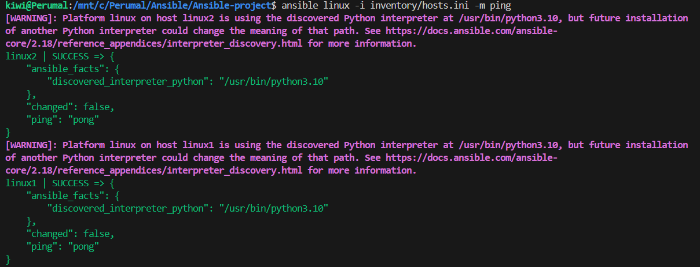

Lets create the lab environment for this setup using docker-compose:

we are going to create 4 linux containers as VM and 2 windows containers as VM for our lab.

    cd ansible-docker-lab/docker
    docker compose up -d --build

Test SSH Connectivity:(since we are running it inside the docker containers it is exposed on different ports on local host)

linux1 : 2221
linux2 : 2222
linux3 : 2223
linux4 : 2224

note: you can refer the docker-compose.yaml

    From your host:

        ssh ansible@localhost -p 2221 (for linxu1 server)

    Password:

        ansible

Try this temporary inventory file for testing inventory/hosts.ini

[linux]
linux1 ansible_host=127.0.0.1 ansible_port=2221
linux2 ansible_host=127.0.0.1 ansible_port=2222
linux3 ansible_host=127.0.0.1 ansible_port=2223
linux4 ansible_host=127.0.0.1 ansible_port=2224

[linux:vars]
ansible_user=ansible
ansible_password=ansible
ansible_ssh_common_args='-o StrictHostKeyChecking=no'

Test: ansible linux1 -i inventory/hosts.ini -m ping

Note you might face ssh-pass error.  If it so, try this command

sudo apt update
sudo apt install sshpass -y

and try this command again: ansible linux1 -i inventory/hosts.ini -m ping

You should get result like this.

🚀 Better Approach:

🔐 SSH Key-based Authentication:

For single server:

ssh-keygen

Then copy the key file to all the host servers on your inventory.ini, it will prompt for password

ssh-copy-id -p 2221 ansible@localhost
ssh-copy-id -p 2222 ansible@localhost
ssh-copy-id -p 2223 ansible@localhost
ssh-copy-id -p 2224 ansible@localhost

For multiple server, update inventory/hosts.ini variables with this line

ansible_ssh_private_key_file=~/.ssh/id_ed25519

Then remove or comment this line from your hosts.ini file

ansible_password=ansible

Then test the connectivity of all the servers, it shouldn't prompt you any password

ansible linux -i inventory/hosts.ini -m ping